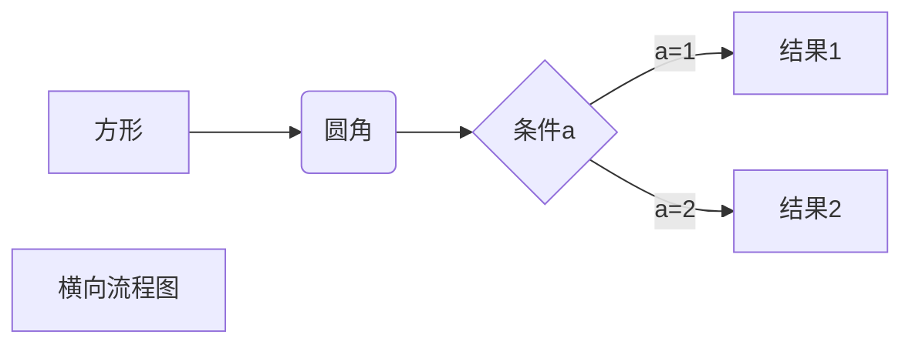
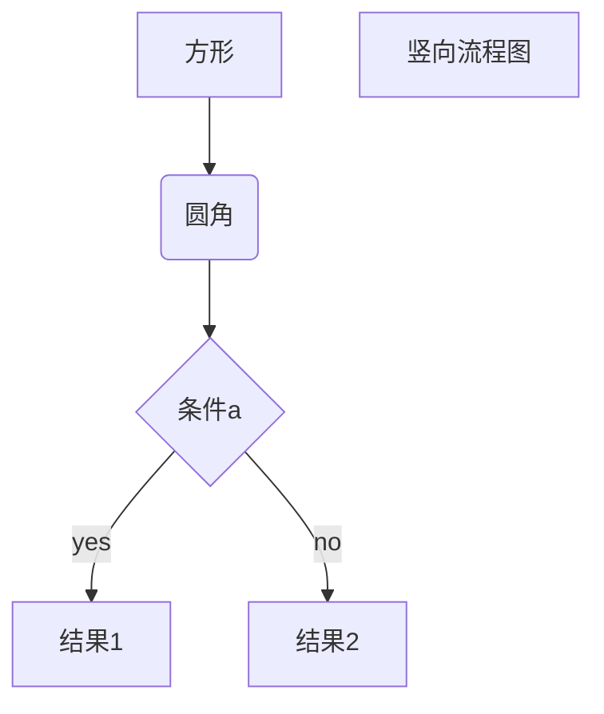
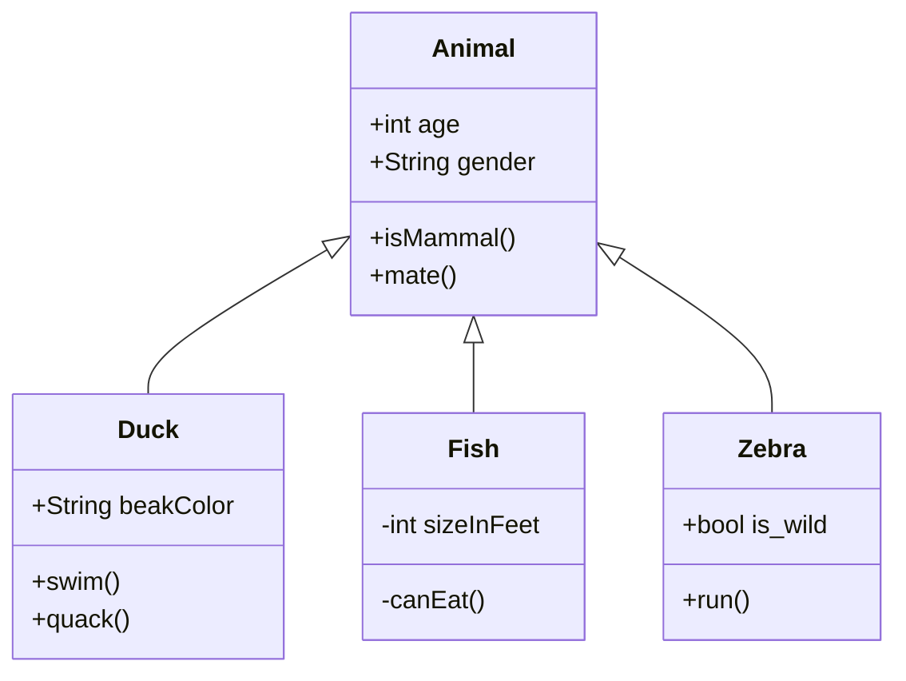

# 流程图

## 基本用法

```mermaid
graph LR
A[方形] -->B(圆角)
    B --> C{条件a}
    C -->|a=1| D[结果1]
    C -->|a=2| E[结果2]
    F[横向流程图]
```

```mermaid
graph TD
A[方形]-->B(圆角)
    B -->C{条件a}
    C -->|yes|D[结果1]
    C -->|no| E[结果2]
    F[竖向流程图]
```

## 类图

```mermaid

 classDiagram
      Animal <|-- Duck
      Animal <|-- Fish
      Animal <|-- Zebra
      Animal : +int age
      Animal : +String gender
      Animal: +isMammal()
      Animal: +mate()
      class Duck{
          +String beakColor
          +swim()
          +quack()
      }
      class Fish{
          -int sizeInFeet
          -canEat()
      }
      class Zebra{
          +bool is_wild
          +run()
      }


```
<bar-chart :data="[['Assignments', 10], ['Midterm', 35], ['Final', 55]]"></bar-chart>
