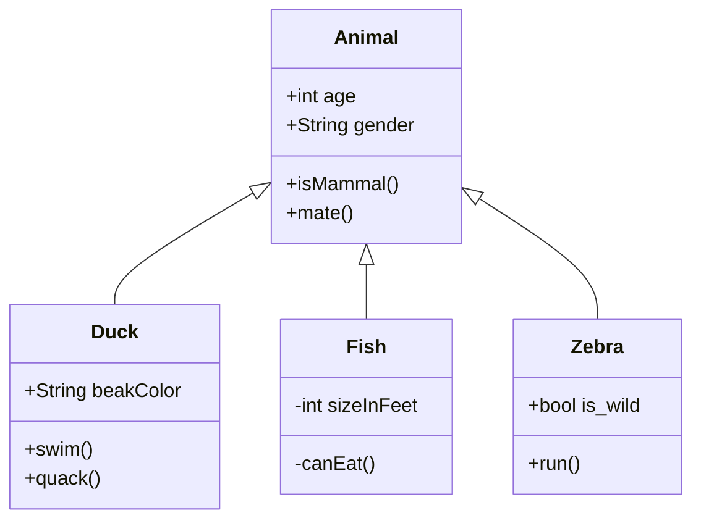
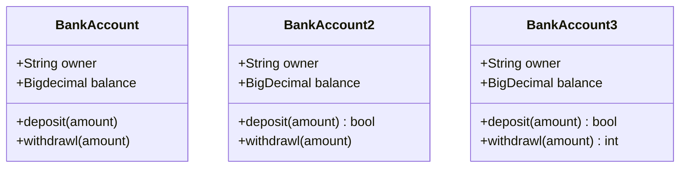
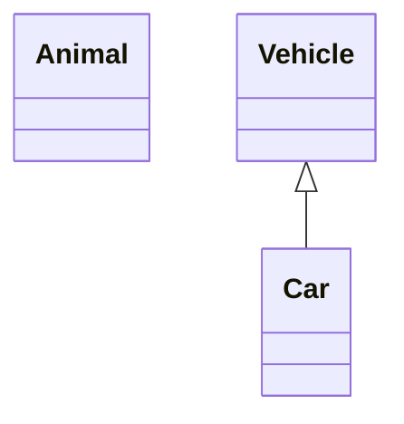
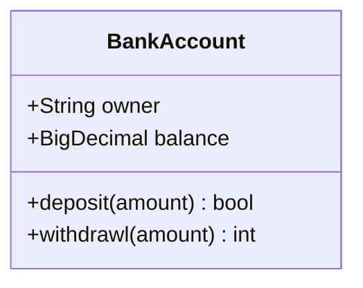
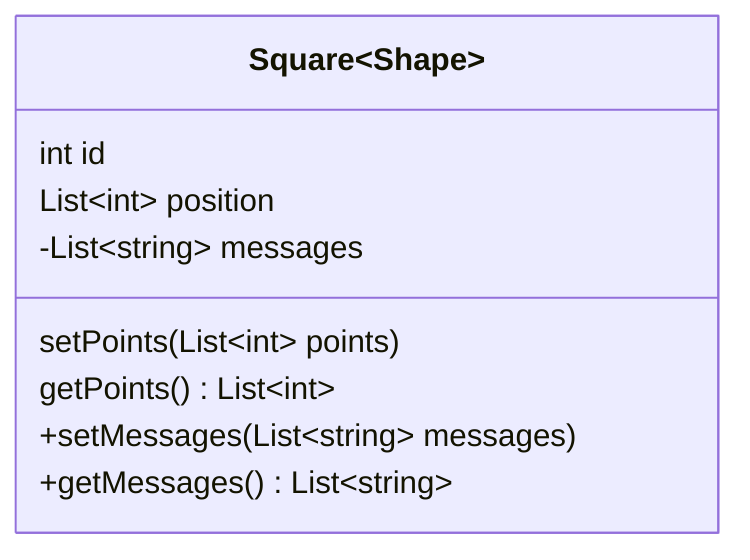
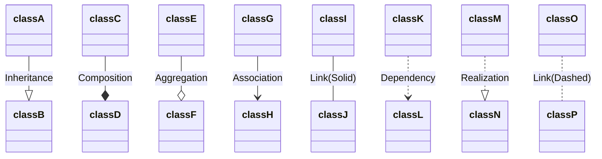
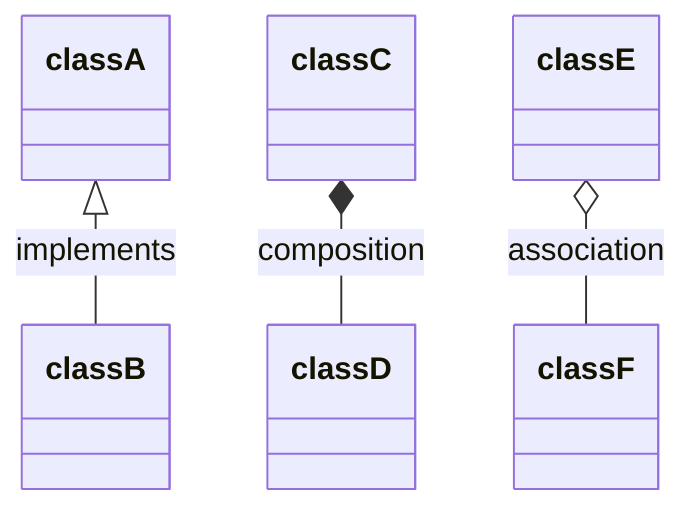
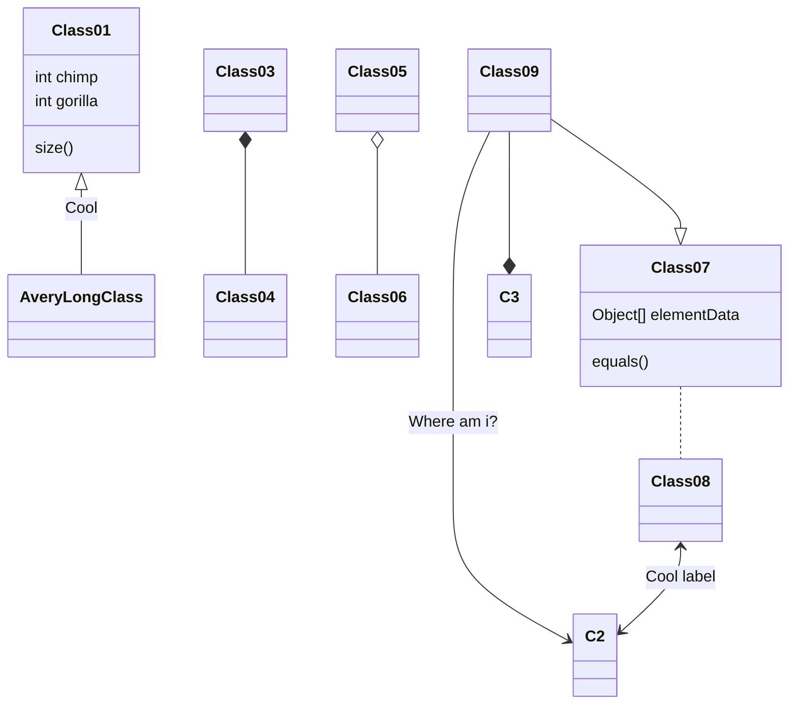
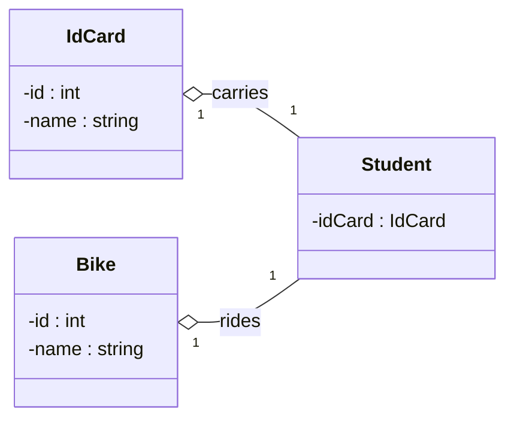

# 类图

## 开始

```mermaid
 classDiagram
      Animal <|-- Duck
      Animal <|-- Fish
      Animal <|-- Zebra
      Animal : +int age
      Animal : +String gender
      Animal: +isMammal()
      Animal: +mate()
      class Duck{
          +String beakColor
          +swim()
          +quack()
      }
      class Fish{
          -int sizeInFeet
          -canEat()
      }
      class Zebra{
          +bool is_wild
          +run()
      }
```

## 基本元素

```mermaid
classDiagram
    class BankAccount
    BankAccount : +String owner
    BankAccount : +Bigdecimal balance
    BankAccount : +deposit(amount)
    BankAccount : +withdrawl(amount)
    

    
    class BankAccount2{
  +String owner
  +BigDecimal balance
  +deposit(amount) bool
  +withdrawl(amount)
}

class BankAccount3{
    +String owner
    +BigDecimal balance
    +deposit(amount) bool
    +withdrawl(amount) int
}


```

```mermaid
classDiagram
class Animal
    Vehicle <|-- Car
  
```

## 传参和返参

```mermaid
classDiagram
class BankAccount{
    +String owner
    +BigDecimal balance
    +deposit(amount) bool
    +withdrawl(amount) int
}
```

## 泛型

```mermaid
classDiagram
class Square~Shape~{
    int id
    List~int~ position
    setPoints(List~int~ points)
    getPoints() List~int~
}

Square : -List~string~ messages
Square : +setMessages(List~string~ messages)
Square : +getMessages() List~string~
```

## 类关系

```mermaid
classDiagram
classA --|> classB : Inheritance
classC --* classD : Composition
classE --o classF : Aggregation
classG --> classH : Association
classI -- classJ : Link(Solid)
classK ..> classL : Dependency
classM ..|> classN : Realization
classO .. classP : Link(Dashed)
```

```mermaid
classDiagram
classA <|-- classB : implements
classC *-- classD : composition
classE o-- classF : association
```

```mermaid
classDiagram
Class01 <|-- AveryLongClass : Cool
Class03 *-- Class04
Class05 o-- Class06
Class07 .. Class08
Class09 --> C2 : Where am i?
Class09 --* C3
Class09 --|> Class07
Class07 : equals()
Class07 : Object[] elementData
Class01 : size()
Class01 : int chimp
Class01 : int gorilla
Class08 <--> C2: Cool label
```

## 总结

```mermaid
classDiagram
  direction RL
  class Student {
    -idCard : IdCard
  }
  class IdCard{
    -id : int
    -name : string
  }
  class Bike{
    -id : int
    -name : string
  }
  Student "1" --o "1" IdCard : carries
  Student "1" --o "1" Bike : rides
```